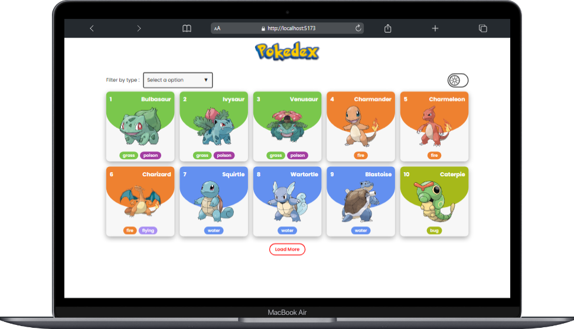
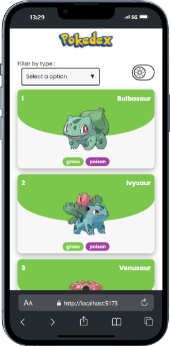
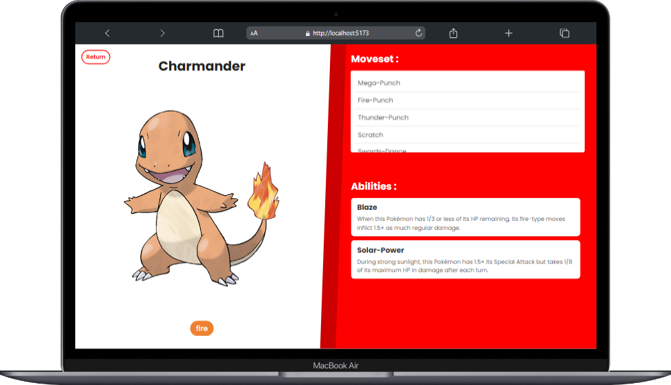
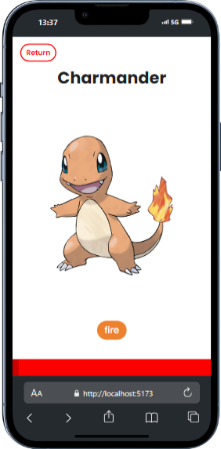
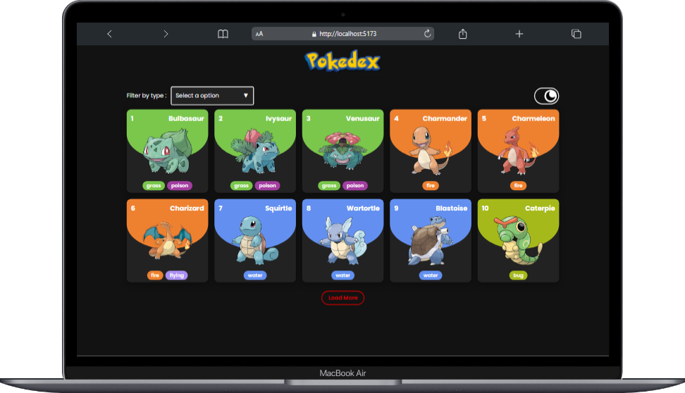
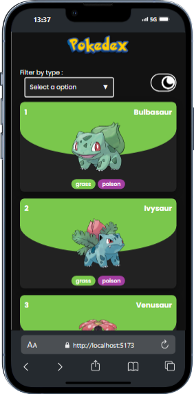

# Quest React Avançado - Pokédex

Esta aplicação foi desenvolvida com o objetivo de colocar os conhecimentos e prática adquirido durante o módulo avançado de React. A intenção era a criação de uma pokédex, que carrega os 10 pokemons iniciais e ao apertar o botão <b>Load More</b>, serão carregados mais 10 pokemons, e um alternador de para modo claro/escuro.

Também como forma de treinar e se desenvolver mais, deveria ser feito uma forma de filtar os pokemons e exibir somente os de certo tipo.

De antemão gostaria de agradecer muito toda a equipe <a href="https://www.instagram.com/devemdobro/" target="_blank">Dev em dobro</a> pelas aulas ministradas, todas foram de extrema importância para o desenvolvimento deste projeto.

## Desktop view | Mobile view

### Tela Inicial
|  |  |
| ------------------------------------------------------------------ | ------------------------------------------------------------------------ |

### Detalhes do Pokemon
|  |  |
| --------------------------------------------------------------------- | --------------------------------------------------------------------------- |

### Modo escuro
|  |  |
| --------------------------------------------------------------------- | --------------------------------------------------------------------------- |

## Funcionalidades

- <b>Integração com API Externa:</b> Coleta dos dados dos pokemons a partir da <a href="https://pokeapi.co/" target="_blank">PokeAPI</a>.
- <b>Modo Escuro/Claro:</b> Alterna entre modos de visualização para a preferência do usuário.

- <b>Dashboard Interativo:</b> Ao selecionar um pokemon uma nova tela com informações sobre suas habilidades e moveset são carregados.
- <b>Filtragem por tipo:</b> Um select para a filtragem de pokemons por tipo.

## Ferramentas Utilizadas

- <b>React:</b> Escolhido por sua eficiência na criação de interfaces dinâmicas e responsivas. <span style="font-size: 10px; font-weight: 700; margin-left: 10px"><a href="https://react.dev/" target="_blank">Acesse aqui a documentação!</a><span>
- <b>Styled-components:</b> Utilizado para estilizar os componentes, facilitando a criação de temas personalizados. <span style="font-size: 10px; font-weight: 700; margin-left: 10px"><a href="https://styled-components.com/" target="_blank">Acesse aqui a documentação!</a><span>
- <b>Axios:</b> Para realizar requisições HTTP, devido à sua simplicidade e suporte robusto para chamadas assíncronas. <span style="font-size: 10px; font-weight: 700; margin-left: 10px"><a href="https://axios-http.com/ptbr/docs/intro" target="_blank">Acesse aqui a documentação!</a><span>
- <b>Context API:</b> Usado para controlar o contexto do tema cores da aplicação. <span style="font-size: 10px; font-weight: 700; margin-left: 10px"><a href="https://react.dev/reference/react/createContext" target="_blank">Acesse aqui a documentação!</a><span>

Essas ferramentas foram selecionadas por oferecerem uma combinação de facilidade de uso, documentação extensa e uma grande comunidade, permitindo o desenvolvimento rápido e com suporte.

## Decisões de Planejamento e Execução
Durante o planejamento, optei por dividir a aplicação em componentes, o que centraliza a manutenção e facilita a expansão da aplicação no futuro. Na hora de implementar o tema de cores, deixei algumas variáveis CSS pré-definidas para facilitar a troca dessas cores para outros tons ou diferentes cores. Para as requisições de dados, utilizei o Axios por já ter familiaridade com ele e sua integração fácil com o React.

## Passo a Passo para Executar o Projeto

Clone o repositório

```
git clone https://github.com/guisalva/quest-react-pokedex.git
```

<br />

Navegue até a pasta do projeto

```
cd pokedex
```

<br />

Instale as dependências

```
npm install
```

<br />

Execute a aplicação localmente na máquina

```
npm run dev
```

<br />

Abra o navegador e acesse a aplicação pelo endereço http://localhost:5173/ ou por outra porta caso esta já esteja em uso na máquina,

---